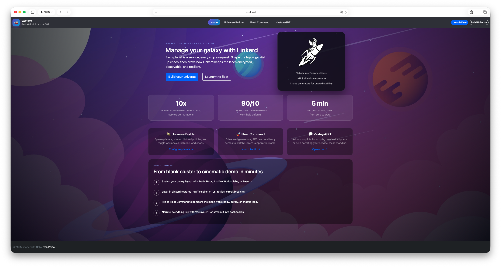

# Todea-Assistant

Kubernetes-native AI demo platform with a React chat UI for installing, managing, and diagnosing a Linkerd service mesh through natural language. Supports Google Gemini (via ADK), Azure OpenAI, or a fully in-cluster Ollama runtime.



---

## Architecture

| Service | Path | Port | Role |
|---|---|---|---|
| **Web** | `web/` | 80 | React SPA + Express static server |
| **Agent Hub** | `servers/agent-hub/` | 3100 | Unified LLM gateway — routes to Google (Gemini/ADK), Azure OpenAI, or Ollama based on the model selected in the UI |
| **MCP Server** | `servers/mcp/` | 3002 | FastMCP tool server; hosts all agent tools (Linkerd, Helm, Kubernetes, OpenSSL, GitHub) |
| **Helm Agent** | `servers/mcp/helm_agent/` | 3400 | HTTP wrapper around `helm` and `kubectl`; called by the MCP server |
| **OpenSSL Agent** | `servers/mcp/openssl_agent/` | 3500 | HTTP wrapper for X.509 certificate generation, inspection, and verification |
| **GitHub Agent** | `servers/mcp/github_agent/` | 3600 | HTTP wrapper around the GitHub REST API; exposes file, directory, code-search, issue, and PR endpoints |
| **Conversation Hub** | `servers/conversation-hub/` | 3300 | Shared conversation + message store for all providers |
| **Training Hub** | `servers/training-hub/` | 3500 | REST + SSE service that manages the ML training pipeline |
| **Ollama Runtime** _(optional)_ | `servers/ollama-runtime/` | 11434 | Custom Ollama image with the model pre-baked |

### MCP server agent structure

The MCP server (`servers/mcp/`) is composed of four agent packages. Each follows the same layout:

```
<agent>/
  __init__.py
  tools.py        ← pure functions (no framework dependency)
  app.py          ← FastAPI HTTP wrapper (HTTP agents) or Google ADK Agent (ADK agents)
  instructions.py ← system prompt / agent instruction string
  requirements.txt
```

| Agent | Type | Tools registered in MCP |
|---|---|---|
| `linkerd_agent` | ADK Agent (root) | Helm install/upgrade/configure/uninstall, linkerd check, cert install |
| `kubernetes_agent` | ADK Agent (sub-agent of linkerd) | Pod/deployment/log/event inspection, crash diagnostics |
| `openssl_agent` | HTTP service | `generate_certificates`, `inspect_certificate`, `verify_certificate_chain` |
| `helm_agent` | HTTP service | `helm upgrade/install/configure/uninstall/status/list`, `kubectl apply/pods` |
| `github_agent` | HTTP service | `github_get_file`, `github_list_directory`, `github_search_code`, `github_get_issue`, `github_get_pr` |

### Service map

```
Browser
  │
  │  HTTP (port 8080 via k3d load balancer)
  ▼
Ingress (Traefik)
  ├── /              → todea-web   :80    React SPA + Express
  ├── /mcp           → todea-mcp   :3002  MCP agent server
  ├── /chat          → todea-agent-hub   :3100  Unified hub (Google · Azure · Ollama)
  ├── /models        → todea-agent-hub   :3100
  ├── /conversations → todea-agent-hub   :3100
  ├── /settings      → todea-agent-hub   :3100  (writes/reads todea-api-keys secret)
  └── /healthz       → todea-agent-hub   :3100

Internal only (no dedicated ingress):
  todea-helm-agent        :3400  ← called by todea-mcp for all helm/kubectl operations
  todea-openssl-agent     :3500  ← called by todea-mcp for certificate operations
  todea-github-agent      :3600  ← called by todea-mcp for GitHub API queries
  todea-conversation-hub  :3300  ← called by the agent-hub for conversation storage
  todea-training-hub      :3500  ← reached via the web pod's proxy at `/training-hub`
```

### Call graph

The Hub dispatches each request to the correct backend based on the `provider` field sent by the UI (derived from the model the user selects in the dropdown).

**Google path** (`provider=google`, requires `GOOGLE_API_KEY` in the `todea-api-keys` secret):
```
React UI  ──► Hub (Gemini ADK)  ──► MCP Server
                   │                      │
                   │               linkerd_agent (ADK root agent)
                   │                      ├── MCPToolset (Linkerd + cert + GitHub tools)
                   │                      │     ├── Helm Agent    :3400  ──► helm/kubectl ──► Kubernetes
                   │                      │     ├── OpenSSL Agent :3500  ──► cert generation/inspection
                   │                      │     └── GitHub Agent  :3600  ──► GitHub REST API
                   │                      └── kubernetes_agent (ADK sub-agent) ──► kubectl ──► Kubernetes
                   │
                   └──► Conversation Hub  (store & retrieve conversation history)
```

**Azure path** (`provider=azure`, requires Azure credentials in the `todea-api-keys` secret):
```
React UI  ──► Hub (/chat/stream SSE)  ──► Azure OpenAI (GPT-4o, cloud)
                   │          │
                   │          └── streams: thinking · tool_call · tool_result · done
                   │
                   │◄── tool results ── MCP Server (Linkerd + OpenSSL + Kubernetes + GitHub tools)
                   │                            │
                   │                ┌───────────┼───────────┐
                   │             Helm Agent  OpenSSL Agent  GitHub Agent
                   │
                   └──► Conversation Hub  (store & retrieve conversation history)
```

**Ollama path** (`provider=ollama`, no API key required):
```
React UI  ──► Hub (/chat/stream SSE)  ──► Ollama (in-cluster or external)
                   │          │
                   │          └── streams: thinking · tool_call · tool_result · done
                   │
                   │◄── tool results ── MCP Server (Linkerd + OpenSSL + Kubernetes + GitHub tools)
                   │                            │
                   │                ┌───────────┼───────────┐
                   │             Helm Agent  OpenSSL Agent  GitHub Agent
                   │
                   └──► Conversation Hub  (store & retrieve conversation history)
```

### Coupling table

| Caller | Callee | Fails if callee is down? |
|---|---|---|
| Hub (Google path) | MCP Server | yes — chat unavailable |
| Hub (Google path) | Conversation Hub | yes — chat and conversation list unavailable |
| Hub (Azure path) | Azure OpenAI | yes — chat unavailable |
| Hub (Azure path) | MCP Server | no — tool calling disabled, plain chat still works |
| Hub (Azure path) | Conversation Hub | yes — chat and conversation list unavailable |
| Hub (Ollama path) | Ollama Runtime | yes — chat unavailable |
| Hub (Ollama path) | MCP Server | no — tool calling disabled, plain chat still works |
| Hub (Ollama path) | Conversation Hub | yes — chat and conversation list unavailable |
| MCP Server | Helm Agent | yes — all Helm/kubectl tools fail |
| MCP Server | OpenSSL Agent | no — cert tools fail, all other tools still work |
| MCP Server | GitHub Agent | no — GitHub tools fail, all other tools still work |

---

## Documentation

### Operations

| Guide | Description |
|---|---|
| [Deployment (k3d)](docs/deployment.md) | k3d cluster setup, Helm install (Gemini, Azure & Ollama paths), updating, rebuilding single services |
| [Local Development](docs/local-development.md) | Running each service locally without k3d |
| [Agents & MCP Tools](docs/agents.md) | MCP agent hierarchy, tool reference, and the Linkerd install sequence |
| [Ollama Reference](docs/ollama.md) | Model management, persistence, live streaming, external Ollama, tool-calling behaviour |

### Azure

| Guide | Description |
|---|---|
| [Infrastructure](docs/azure/infrastructure.md) | Resource group, ACR, AKS cluster, GPU spot node pool, NVIDIA device plugin |
| [Build & Deploy](docs/azure/deploy.md) | Building and pushing images to ACR, creating the namespace and PVC, Helm deploy (Gemini & Ollama paths) |
| [Training Pipeline](docs/azure/training.md) | Running scrape → train → serve via the UI, updating a deployment, continuous training CronJob, useful commands, cost estimate |

### ML & Training

| Guide | Description |
|---|---|
| [Training](docs/training.md) | Training UI, fine-tuning pipeline, and serving a custom Linkerd model |
| [Data Quality](docs/ml/data-quality.md) | Assessment of the current training dataset — sources, statistics, concerns, and recommendations |
| [Continuous Training](docs/ml/continuous-training.md) | Scheduled and event-triggered retraining loop, pipeline architecture, training strategy trade-offs |
| [RAG over Source Code](docs/ml/rag.md) | Why RAG beats training on code, vector store options, chunking strategy, and new MCP tool design |
| [Model Selection & Infrastructure](docs/ml/model-selection.md) | llama3.1:8b vs Qwen2.5-7B-Instruct, AKS vs home GPU, MLOps tool landscape and recommended stack |

---

## License

Refer to the individual directories for licensing terms.
